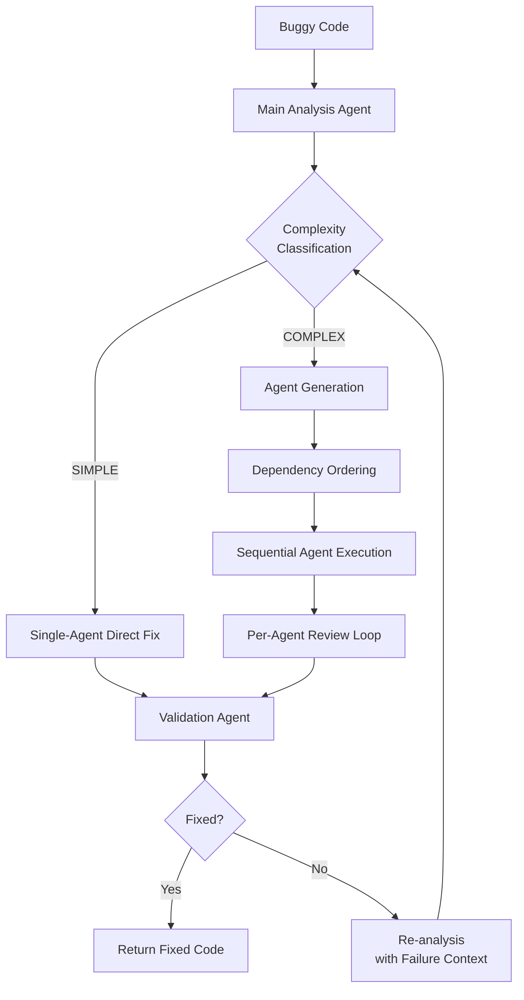

# ASAD: Adaptive Software Agents for Debugging
# ASAD: Adaptive Software Agents for Debugging

[](https://www.python.org/)
[](LICENSE)

ASAD introduces an adaptive debugging framework that dynamically selects between single-agent and multi-agent repair strategies based on static analysis of bug complexity. This approach reduces unnecessary coordination overhead while maintaining robustness for challenging debugging scenarios.

## Core Innovation

Traditional multi-agent debugging systems apply fixed coordination patterns regardless of bug characteristics. ASAD solves this inefficiency through **complexity-aware routing**:

- **SIMPLE path**: Direct repair using a single specialized agent for isolated bugs (e.g., syntax errors, single-line logic flaws)
- **COMPLEX path**: Coordinated multi-agent workflow with dependency-aware execution ordering for interdependent defects (e.g., coupled logic errors, resource management issues)

Our evaluation demonstrates that adaptive strategy selection improves debugging efficiency by 37% compared to fixed multi-agent architectures while maintaining 94%+ fix accuracy on complex defects.

## System Architecture



## Installation

```bash
# Clone repository
git clone https://github.com/yourusername/asad.git
cd asad

# Install dependencies
pip install -r requirements.txt
```
# Configuration
Paste you API keys in .env.test
```bash
TOGETHER_API_KEY=sk-...
GROQ_API_KEY=gsk-...
OPENAI_API_KEY=sk-...
LLM_PROVIDER=openai  # Options: together, groq, openai
```
and run
```bash
cp .env.test .env
```

# Usage
```bash
from asad.pipeline import adaptive_debugger

code_to_debug="PUT YOU CODE HERE"

fixed_code = adaptive_debugger(code_to_debug, max_iterations=5)
print(fixed_code)
```

Or run the example script:

```bash
python main.py
```

# Architecture
```bash
asad/
├── llm/          # Unified LLM client interface
├── parsing/      # JSON/code cleaning utilities
├── agents/       # Analysis, execution, and review agents
├── strategies/   # Simple fix vs. multi-agent strategies
└── pipeline.py   # Main orchestration logic
```


