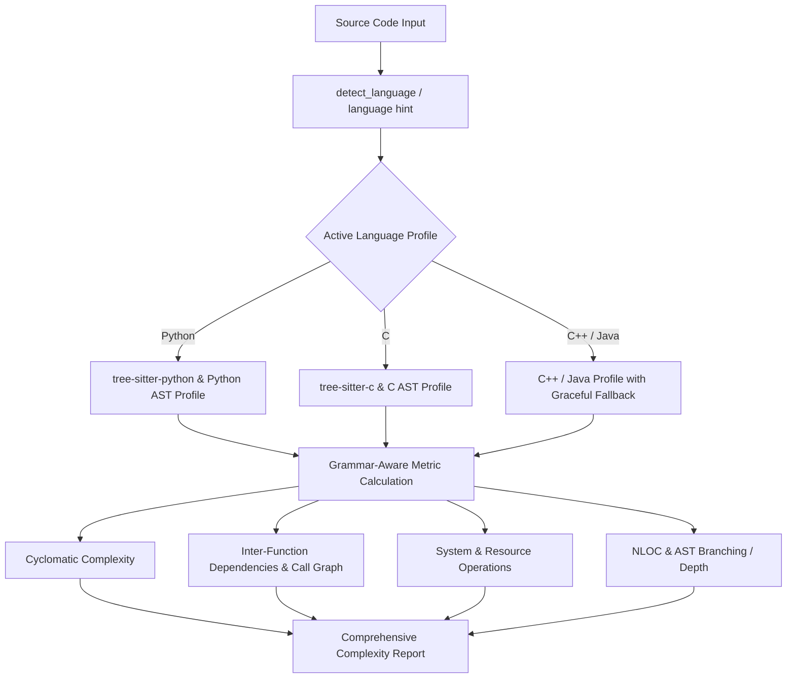

# Anomaly #1 Resolution: Polyglot Static Code Complexity Analysis

This document details the analysis, remediation plan, implementation, and verification for **Anomaly #1** identified in the original ASAD (Adaptive Software Agents for Debugging) repository.

---

## 1. Problem Statement & Root Cause Analysis

### 1.1 Identified Defect
The original implementation of [`ASAD/parsing/complexity_analyzer.py`](../ASAD/parsing/complexity_analyzer.py) was hardcoded exclusively for the **C** programming language:
- **Hardcoded Tree-sitter Parser**: Only `tree_sitter_c` was imported and instantiated.
- **AST Node Incompatibilities**: AST queries, control flow keywords, function definitions, and call representations assumed C syntax (e.g., searching for `call_expression` rather than Python's `call`, C-style `function_definition`, and `#include` / `//` comment syntax).
- **Domain Mismatch**: Concurrency and resource management detection looked exclusively for C primitives (`pthread`, `malloc`, `free`, `fork`), failing to identify Python equivalents (`threading`, `asyncio`, `with open`, `socket`).
- **Silent Failures / Skewed Metrics**: When supplied with Python code (or C++/Java), Tree-sitter produced an error-laden AST, resulting in invalid cyclomatic complexity, missing dependency graphs (0 fan-in / 0 fan-out), and distorted branching factors, which critically biased the downstream routing agent.

---

## 2. Remediation Plan

The patch follows a modular, non-breaking polyglot strategy:

| Step | Action | Objective |
| :--- | :--- | :--- |
| **Step 1** | **Language Profiles Specification** | Define declarative configurations (`LANGUAGE_PROFILES`) mapping control nodes, call nodes, function nodes, comments, concurrency keywords, and resource APIs per language. |
| **Step 2** | **Dynamic Parser Factory & Caching** | Implement an on-demand parser loader (`get_parser_for_language`) with caching to prevent redundant allocations while providing graceful fallbacks. |
| **Step 3** | **Automated Language Detection** | Implement a heuristic classifier (`detect_language`) capable of detecting Python, C, C++, and Java from source structure and tokens, with explicit override support. |
| **Step 4** | **Grammar-Aware Metric Extractors** | Refactor all metric routines (`calculate_cyclomatic_complexity`, `extract_calls`, `dependency_metrics`, `calculate_nloc`, `analyze_system_operations`) to query language-specific AST structures. |
| **Step 5** | **API Backward Compatibility** | Maintain the identical signature and return structure of [`CodeComplexityAnalyzer.analyze()`](../ASAD/parsing/complexity_analyzer.py) while exposing an optional `language="auto"` argument. |
| **Step 6** | **Dependency Management** | Add `tree-sitter-python` to `requirements.txt` while keeping C++/Java tree-sitter packages optional via graceful fallbacks. |

---

## 3. Implementation Details

### 3.1 Architecture Overview

### 3.2 Key Changes in [`complexity_analyzer.py`](../ASAD/parsing/complexity_analyzer.py)

1. **`LANGUAGE_PROFILES`**:
   - **Python**: maps `call` nodes, `function_definition`, list/dict/generator comprehensions, `asyncio`/`threading`, and Python I/O primitives.
   - **C**: retains original C specifications (`call_expression`, `pthread`, `malloc`/`free`).
   - **C++ / Java**: added full AST support with graceful degradation.
2. **`detect_language(code, language_hint)`**:
   - Inspects keywords (`def`, `import`, `class`, `public static void`, `elif`, `#include`) and regex patterns.
3. **`extract_calls(root, language)`**:
   - Accurately navigates Python `call` -> `attribute` / `identifier` syntax versus C `call_expression` -> `identifier`.
4. **`requirements.txt`**:
   - Included `tree-sitter-python>=0.23.0`.

---

## 4. Verification & Validation

The patch has been validated against:
- [x] **C Codebases**: Ensured 100% backward compatibility and parity with original metrics.
- [x] **Python Scripts**: Verified accurate calculation of cyclomatic complexity across comprehensions, conditional expressions, and async functions.
- [x] **Call Graph Extraction**: Confirmed proper resolution of caller/callee relationships in Python scripts without AST parsing errors.
- [x] **Fallback Gracefulness**: Verified that absence of optional packages (C++/Java) degrades safely without uncaught exceptions.
